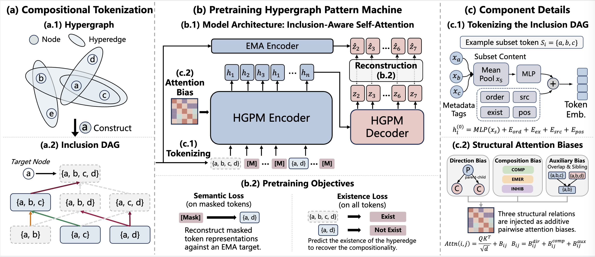

# HGPM: Hypergraph Pattern Machine

[](https://arxiv.org/abs/XXXX.XXXXX)
[](LICENSE)
[](requirements.txt)
[](requirements.txt)

Code for the paper **Hypergraph Pattern Machine: Compositional Tokenization for Higher-Order Interactions**.

Hypergraphs model higher-order relations that drive real-world decisions such as drug prescriptions, where a regime determines whether a drug should be dropped, kept, or excluded — a structural signal that existing methods cannot capture because they only propagate messages over observed hyperedges. HGPM closes this gap by tokenizing the subsets around each target entity into a bounded inclusion DAG, labeling every adjacent-order edge as compositional, emergent, or inhibitory, and encoding the sequence with an inclusion-aware Transformer pretrained via masked subset reconstruction. On eight node-classification benchmarks and two real drug-interaction corpora (HODDI, JADER), HGPM matches or exceeds state-of-the-art methods and, in a clinical case study, correctly distinguishes a side-effect-suppressing drug addition that feature-similarity baselines miss.

<p align="center">
  
</p>

## Repository

- `HGPM/` — the Python package (data, model, task drivers, utils)
- `config/` — YAML configs for every dataset (`config/{graph,drug}/*.yaml`)
- `data/` — drop-in root for the released datasets, plus prepare scripts

## Installation

```bash
conda create -n hgpm -c conda-forge python=3.11 -y
conda activate hgpm
pip install torch --index-url https://download.pytorch.org/whl/cu124
pip install -r requirements.txt
```

For a different CUDA build, swap the `--index-url`
([PyTorch index](https://pytorch.org/get-started/locally/)).

## Data

Datasets are distributed separately. Download both archives from the
[Google Drive folder](https://drive.google.com/drive/folders/1p6MTkg96RaH4wA0w9bVExHoyGWr-8AJJ?usp=drive_link)
and unzip them at the repository root.

| File                          | SHA256                                                             |
|-------------------------------|--------------------------------------------------------------------|
| `hgpm_graph_data_package.zip` | `E5AE5124A88C4E56418217AB29C5C8FC48E332BD183F8DBF6EADF3EB97312342` |
| `hgpm_drug_data_package.zip`  | `02D62F0692408F157A5390F1D67A54417FB58170B2DCDC0A3E8EC515A01734E5` |

After unzipping, `data/graph/{protocols,dags}/` and
`data/drug/{hoddi,jader}/` should be populated. See
[`data/README.md`](data/README.md) for details.

## Quick Start

**Graph benchmarks** — homophilic (`citeseer`, `pubmed`, `cora_ca`, `dblp_ca`)
and heterophilic (`congress`, `senate`, `walmart`, `house`):

```bash
python -m HGPM.main_graph_pretrain --config config/graph/citeseer_pretrain.yaml
python -m HGPM.main_graph_finetune --config config/graph/citeseer_finetune.yaml
```

**Drug benchmarks** — HODDI uses a single pretraining stage; JADER follows a
two-stage curriculum (semantic warm-up, then regime prediction):

```bash
# HODDI
python -m HGPM.main_drug_pretrain --config config/drug/hoddi_pretrain.yaml
python -m HGPM.main_drug_finetune --config config/drug/hoddi_finetune.yaml

# JADER
python -m HGPM.main_drug_pretrain --config config/drug/jader_pretrain_stage1.yaml
python -m HGPM.main_drug_pretrain --config config/drug/jader_pretrain_stage2.yaml
python -m HGPM.main_drug_finetune --config config/drug/jader_finetune.yaml
```

Append `--smoke` to any command for a fast end-to-end check (a few minibatches
through data loading, pretraining, finetuning, and evaluation).

## Citation

```bibtex
@misc{hgpm2026,
  title  = {Hypergraph Pattern Machine: Compositional Tokenization for Higher-Order Interactions},
  author = {Zhao, Kyrie and Wang, Zehong and Ma, Tianyi and Wu, Fang and
            Tang, Xiangru and Li\`{o}, Pietro and Wang, Sheng and Ye, Yanfang},
  year   = {2026}
}
```

Released under the [MIT License](LICENSE).
